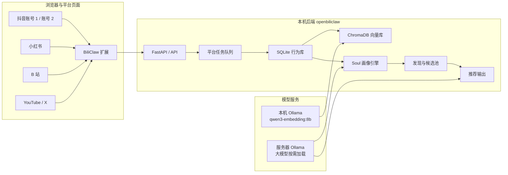

# BiliClaw Extended

[](https://github.com/Yan-ShiBo/BiliClaw-Extended/actions)
[](pyproject.toml)
[](extension/manifest.json)

BiliClaw Extended 是一个本地优先的跨平台内容理解与推荐系统。它从浏览器扩展收集你自己账号里已经能看到的公开页面信号，把 B 站、抖音、小红书、YouTube、X 等平台的行为沉淀到本机数据库、向量库和长期画像中，再用本机或自有服务器上的 LLM 生成画像、检索和推荐。

本仓库是 `Yan-ShiBo/BiliClaw-Extended` 的当前主线。Python 包名和 CLI 仍保留 `openbiliclaw`，这是为了兼容已有命令、配置和数据目录。

## 当前状态

- 后端默认运行在 `http://127.0.0.1:8420`，Web 入口是 `/web`，初始化入口是 `/setup/`。
- 浏览器扩展版本为 `0.3.159`，加载目录是 `extension/`。
- 主要内容源：抖音、B 站；次要内容源：YouTube、小红书；补充内容源：X。
- 支持同一个实例里分开处理两个抖音账号：登录哪个账号，就导入哪个账号的喜欢、收藏、关注和发布信号。
- 抖音喜欢已接入本地 ChromaDB 向量库，默认使用本机 Ollama `qwen3-embedding:8b` 做 embedding。
- 重度画像和推荐分析可以使用服务器 Ollama 上的大模型，调用完成后可以卸载模型释放显存。
- 画像分析会对来源做轻量再平衡：B 站、小红书、第二个抖音账号权重略高；第一个抖音账号的很早历史信号权重略低，避免一个大样本源压过其它平台。

## 架构概览



## 快速启动

```powershell
git clone https://github.com/Yan-ShiBo/BiliClaw-Extended.git D:\BiliClaw
cd D:\BiliClaw
python -m venv .venv
.\.venv\Scripts\python -m pip install -e ".[dev]"
copy config.example.toml config.toml
openbiliclaw serve-api --host 0.0.0.0 --port 8420
```

然后打开：

- 设置页：`http://127.0.0.1:8420/setup/`
- Web 推荐页：`http://127.0.0.1:8420/web`
- 健康检查：`http://127.0.0.1:8420/api/health`

## 浏览器扩展安装

1. 打开 Chrome 或 Edge 的 `chrome://extensions/`。
2. 开启“开发者模式”。
3. 点击“加载已解压的扩展程序”。
4. 选择仓库里的 `D:\BiliClaw\extension`。
5. 确认扩展版本显示为 `0.3.159`。

更新扩展代码后需要回到扩展管理页点击“重新加载”。版本号会跟随仓库变更递增，便于确认浏览器加载的是新包。

## LLM 与 Embedding

推荐配置是“本机 embedding + 服务器 LLM”：

```toml
[llm]
default_provider = "ollama"

[llm.ollama]
model = "qwen3.5:122b"
base_url = "http://YOUR_SERVER_IP:11434/v1"

[llm.embedding]
provider = "ollama"
model = "qwen3-embedding:8b"
base_url = "http://127.0.0.1:11434/v1"
```

说明：

- embedding 可以放本机，也可以放服务器；当前主线默认优先本机，避免每批导入都占用服务器显存。
- 大模型只在画像重算、候选评估、推荐解释等需要推理时使用。
- 服务器模型用完后建议调用 Ollama unload 或停止服务，释放 4090 / 3090 显存。
- 不要把真实 IP、用户名、密码、Cookie、API Key 提交到 GitHub。

## 多账号与多平台处理

两个抖音账号不是混在一起抓取，而是分开处理：

1. 浏览器登录第一个抖音账号。
2. 在扩展里导入 `dy_like`、`dy_collect`、`dy_follow`、`dy_post`。
3. 切换到第二个抖音账号，或使用另一个浏览器 Profile。
4. 再导入同样的任务。

后端会通过 `metadata.account_id`、平台来源和时间顺序计算 `metadata.analysis_weight`，画像时按权重合并，而不是把所有视频当成同质样本。

小红书也通过扩展在真实登录态下处理喜欢、收藏和页面观察信号。由于小红书和抖音都有风控，长列表导入应该分批推进，并保留每批进度。

## 文档入口

- [文档索引](docs/index.md)
- [系统架构](docs/architecture.md)
- [项目规格](docs/spec.md)
- [本地部署说明](docs/setup/local-deployment.md)
- [多源画像与权重](docs/features/multi-source-profile.md)
- [推荐刷新运维记录](docs/operations/recommendation-refresh.md)
- [Soul 模块文档](docs/modules/soul.md)
- [变更日志](docs/changelog.md)
- [历史计划归档](docs/archive/README.md)

## 开发命令

```powershell
ruff format src/ tests/
ruff check src/ tests/
mypy src/
pytest
pytest --cov=openbiliclaw
```

本地体验 CLI：

```powershell
openbiliclaw config-show
openbiliclaw profile
openbiliclaw recommend
openbiliclaw serve-api --host 0.0.0.0 --port 8420
```

## 数据与隐私

默认数据流是：浏览器扩展 -> 你本机运行的后端 -> 本机 SQLite / ChromaDB / JSON 文件。扩展不会把数据发给项目维护者的服务器。只有当你显式配置云端或服务器 LLM / embedding 时，对应文本才会发给你配置的模型服务。

仓库中不会提交：

- `config.toml`
- 平台 Cookie
- API Key
- 服务器登录凭据
- `data/`、`logs/`、本地向量库和运行时缓存

## Fork 说明

项目起源于 OpenBiliClaw，本仓库保留了兼容性的包名、CLI 名和部分历史文档归档；当前活跃维护、部署说明、链接、issue 和 release 均以 [Yan-ShiBo/BiliClaw-Extended](https://github.com/Yan-ShiBo/BiliClaw-Extended) 为准。
