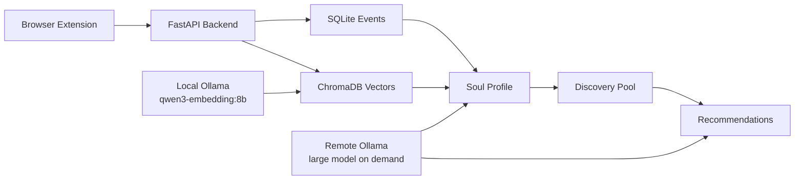

# BiliClaw Extended

[](https://github.com/Yan-ShiBo/BiliClaw-Extended/actions)
[](pyproject.toml)
[](extension/manifest.json)

BiliClaw Extended is a local-first, cross-platform personal content intelligence system. It collects signals from platform pages you can already access in your browser, stores them locally, builds a long-term profile, and uses local or self-hosted LLMs to refresh recommendations.

The Python package and CLI keep the `openbiliclaw` name for compatibility. The active repository, documentation, issues, and release workflow are now owned by [Yan-ShiBo/BiliClaw-Extended](https://github.com/Yan-ShiBo/BiliClaw-Extended).

## Current Focus

- Local backend at `http://127.0.0.1:8420`.
- Web UI at `/web`; setup wizard at `/setup/`.
- Browser extension version `0.3.159`.
- Primary sources: Douyin and Bilibili.
- Secondary sources: YouTube and Xiaohongshu.
- Supplemental source: X.
- Douyin likes are embedded into a local ChromaDB store with Ollama `qwen3-embedding:8b`.
- Heavy profile and recommendation analysis can use a remote Ollama server model on demand, then unload it to release GPU memory.
- Source balancing is enabled so Bilibili, Xiaohongshu, and the second Douyin account are not drowned out by the first large Douyin account.

## Architecture



## Quick Start

```powershell
git clone https://github.com/Yan-ShiBo/BiliClaw-Extended.git D:\BiliClaw
cd D:\BiliClaw
python -m venv .venv
.\.venv\Scripts\python -m pip install -e ".[dev]"
copy config.example.toml config.toml
openbiliclaw serve-api --host 0.0.0.0 --port 8420
```

Open:

- `http://127.0.0.1:8420/setup/`
- `http://127.0.0.1:8420/web`
- `http://127.0.0.1:8420/api/health`

## Extension

Load `D:\BiliClaw\extension` from `chrome://extensions/` with Developer Mode enabled. After extension changes, reload the unpacked extension and confirm version `0.3.159`.

## Model Setup

Recommended local/private setup:

```toml
[llm]
default_provider = "ollama"

[llm.ollama]
model = "qwen3.5:122b"
base_url = "http://YOUR_SERVER_IP:11434/v1"

[llm.embedding]
provider = "ollama"
model = "qwen3-embedding:8b"
base_url = "http://127.0.0.1:11434/v1"
```

Do not commit real server credentials, cookies, API keys, `config.toml`, `data/`, or `logs/`.

## Documentation

- [Documentation Index](docs/index.md)
- [Architecture](docs/architecture.md)
- [Project Spec](docs/spec.md)
- [Local Deployment](docs/setup/local-deployment.md)
- [Multi-source Profile](docs/features/multi-source-profile.md)
- [Recommendation Refresh Operations](docs/operations/recommendation-refresh.md)
- [Soul Module](docs/modules/soul.md)
- [Changelog](docs/changelog.md)

## Development

```powershell
ruff format src/ tests/
ruff check src/ tests/
mypy src/
pytest
```

Default data flow is browser extension -> your local backend -> local SQLite / ChromaDB / JSON files. Text only leaves the machine when you configure a remote model or embedding provider.
