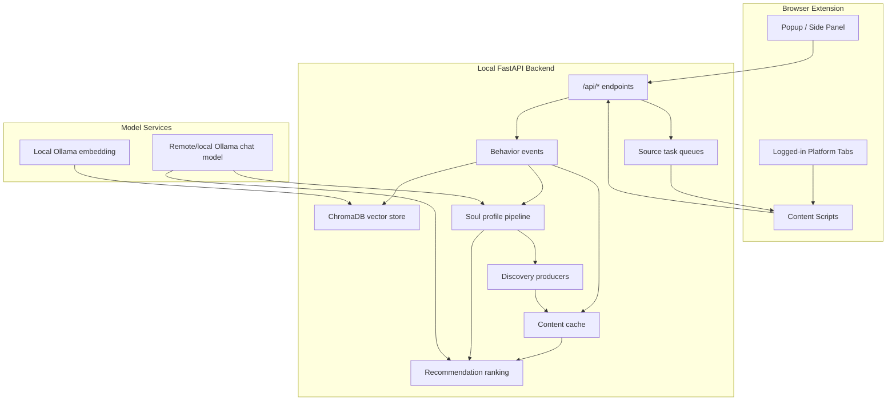
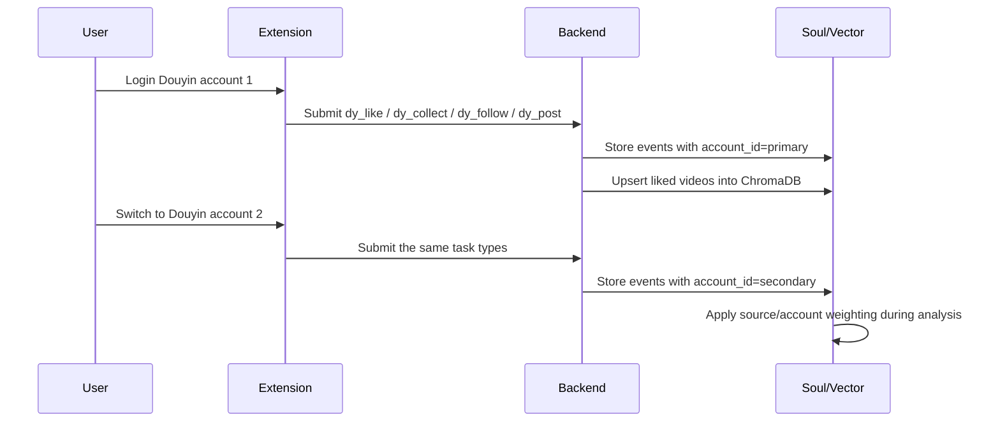

# Architecture

BiliClaw Extended runs as a local backend plus a browser extension. The backend owns storage, long-term profile state, discovery scheduling, recommendation ranking, and model calls. The extension owns logged-in browser context and platform page observation.

## Module Map

| Layer | Main path | Responsibility |
| --- | --- | --- |
| API/runtime | `src/openbiliclaw/api/` | FastAPI app, setup page, web UI APIs, source task endpoints |
| Agent/orchestration | `src/openbiliclaw/agent/` | Runtime wiring and higher-level command orchestration |
| Platform sources | `src/openbiliclaw/bilibili/`, source adapters, `extension/src/` | Bilibili, Douyin, Xiaohongshu, YouTube, X, Zhihu, Reddit collection and discovery |
| Storage | `src/openbiliclaw/memory/`, SQLite helpers | Events, content cache, profile files, cost/runtime state |
| Soul/profile | `src/openbiliclaw/soul/` | Preference analysis, layered profile, cognition, speculation, manual edits |
| Discovery | `src/openbiliclaw/discovery/` | Query planning, source producers, candidate admission |
| Recommendation | `src/openbiliclaw/recommendation/` | Candidate scoring, card generation, feedback loop |
| LLM/embedding | `src/openbiliclaw/llm/` | Provider registry, prompts, structured output parsing, embedding service |
| Extension | `extension/` | Browser session collection, task execution, popup/side panel |

## Data Flow

## Runtime Contracts

- The browser extension never needs platform passwords. It runs inside the user-controlled logged-in browser session.
- Backend storage is local by default: SQLite, JSON/Markdown profile files, and ChromaDB under `data/`.
- `config.toml` is local-only and must not be committed.
- LLM chat and embedding are separate. Chat can point to a remote server; embedding can stay on the local machine.
- Server Ollama should be treated as an on-demand accelerator. Large models can be loaded for analysis and unloaded afterward.

## Douyin Multi-account Flow

Two Douyin accounts are handled in separate browser sessions:

The system does not require both accounts to be open at the same time. The active login controls which account is imported.

## Profile Weighting

`PreferenceAnalyzer` annotates compact event metadata with `analysis_weight` before calling the LLM. The current policy is intentionally mild:

- Bilibili: slightly above neutral.
- Xiaohongshu: slightly above neutral.
- Secondary Douyin account: slightly above neutral.
- First Douyin account old-tail likes: slightly decayed by recency, with a floor so old interests are not discarded.

This keeps the large first Douyin import useful without letting it erase smaller but fresher sources.

## Recommendation Refresh

The recommendation loop uses:

1. Current Soul profile.
2. Source-balanced candidate pool.
3. Existing content cache and unread/shown state.
4. Optional server LLM analysis for profile and card reasoning.
5. Local API verification through `/api/health`, `/api/runtime-status`, `/api/recommendations`, and `/web`.

When recommendations appear unchanged, the usual cause is an old fresh pool still being served. The operations path is to back up runtime data, stale or drain old candidates, refresh with the new profile, then verify the visible pool.
