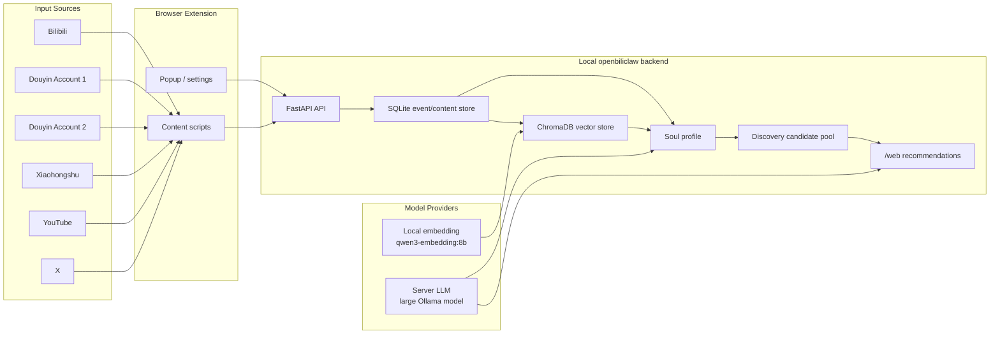

# BiliClaw Extended Spec

## 1. Goal

BiliClaw Extended should become a local-first personal content intelligence layer. It should understand the user's long-term taste across platforms, explain why content is recommended, and let the user keep control over data, model endpoints, and platform sessions.

## 2. Product Requirements

| Requirement | Current Status |
| --- | --- |
| Local backend and local storage | Implemented with FastAPI, SQLite, JSON profile files, and ChromaDB |
| Browser-extension based platform collection | Implemented for Bilibili, Douyin, Xiaohongshu, YouTube, X, Zhihu, Reddit paths |
| Douyin liked-video vector database | Implemented with ChromaDB and Ollama embedding |
| Two Douyin accounts in one instance | Supported by separate login/import passes and account metadata |
| Local or server LLM selection | Supported through Ollama/OpenAI-compatible config |
| Separate embedding provider | Supported through `[llm.embedding]` |
| Source-balanced profile analysis | Implemented through `metadata.analysis_weight` |
| Recommendation pool refresh | Implemented through scheduler/runtime APIs |
| Sensitive local config exclusion | Required: do not commit `config.toml`, cookies, API keys, or runtime data |

## 3. System Architecture Diagram



## 4. Source Policy

Primary sources:

- Douyin
- Bilibili

Secondary sources:

- YouTube
- Xiaohongshu

Supplemental source:

- X

Source weighting should correct sample imbalance, not override the user's real behavior. The first Douyin account has the largest sample and therefore receives mild recency decay on old items. Smaller sources receive mild boosts so their signals remain visible in profile generation.

## 5. Model Policy

Embedding:

- Default: local Ollama `qwen3-embedding:8b`.
- Alternative: server Ollama or another embedding provider through `[llm.embedding]`.
- Embedding is allowed to run continuously during batch imports because it is deterministic and cheaper than chat LLM analysis.

Chat LLM:

- Default for high-quality analysis: server Ollama large model.
- Use on demand for profile rebuilds, candidate evaluation, and recommendation explanation.
- Unload server models after analysis when GPU memory should be released.

## 6. Data Policy

Committed:

- Source code.
- Extension source and package metadata.
- Config examples.
- Current documentation.
- Historical docs under `docs/archive/`.

Not committed:

- `config.toml`
- API keys
- Platform cookies
- Server credentials
- `data/`
- `logs/`
- `.tmp/`

## 7. Verification Requirements

For code changes:

```powershell
ruff check src/ tests/
mypy src/
pytest
```

For profile/recommendation changes:

- Verify `/api/health`.
- Verify `/api/runtime-status`.
- Verify `/api/recommendations`.
- Verify `/web`.
- Check recommendation source mix after refresh.

For extension changes:

- Bump extension version.
- Rebuild or reload the unpacked extension.
- Confirm the version shown in `chrome://extensions/`.
- Manually verify the changed source task in a logged-in tab.
